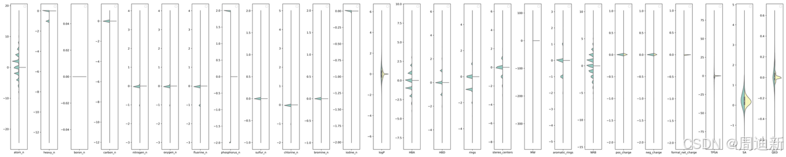

# QuickCoy: A fast way of generating unbiased decoy molecules for better virtual screening using deep learning

## Overview

A key step in training a virtual screening model is to prepare a dataset consisting of actives and decoys. There are already several datasets for training such models, but most of the time, we are actually lacking a method which can generate unbiased decoys for a new set of actives quickly. Besides, more and more studies have proved that previously released virtual screening datasets have hidden bias and the bias in datasets leads to overestimating the performance of deep learning in virtual screening.
**Two key tasks**
    1. **Generating unbiased decoy**: property-matched, etc. maybe need more studies.
    2. **Get 3D binding pose:** Smina or molecular docking by deep learning: Generating 3D binding pose on a given molecule and a protein binding site.

## Conclusion
Our experimental results show that our decoy can enhance the generalization ability of structure-based deep learning virtual screening models and reduce the problem of overestimation.

## Model
Utilizing a bidirectional77 Gated Recurrent Unit (GRU) with a linear output layer as an encoder. The decoder is a 3-layer GRU RNN of 512 hidden dimensions with intermediate dropout layers with dropout probability 0.2. Training is done with a batch size of 128, utilizing a gradient clipping of 50, KL-term weight of 1, and optimized with Adam with a learning rate of 0.0003 for 50 epochs. A trained CVAE model which can generate molecules conditioned on 27 properties.

# Usage
**Training QuickCoy**
```
./inverse_design.py --n_batch 128 --checkpoint_dir /home/zdx/project/decoy_generation/result/REAL_discrete_13 --train_load /home/zdx/data/REAL/REAL_deepcoy_properties.csv --pro_cols carbon_n nitrogen_n oxygen_n fluorine_n sulfur_n chlorine_n bromine_n HBA HBD rings stereo_centers aromatic_rings NRB
```

# Data
[DeepChem dataloader](https://github.com/deepchem/deepchem/tree/master/deepchem/molnet/load_function)   
[DeepChem Dataset](https://moleculenet.org/datasets-1)   
[DGL-LifeSci Dataset](https://lifesci.dgl.ai/api/data.html)   
[MUV data generator](https://github.com/skearnes/muv)   
[LIT-PCBA Paper](https://pubs.acs.org/doi/10.1021/acs.jcim.0c00155)    
[LIT-PCBADownload](https://drugdesign.unistra.fr/LIT-PCBA/)   
Make sure molecules in triaining set, 27 properties should have values.

# Resource
1. [InteractionGraphNet](https://pubs.acs.org/doi/10.1021/acs.jmedchem.1c01830)
2. [TocoDecoy](https://pubs.acs.org/doi/10.1021/acs.jmedchem.1c01830) paper
3. [TocoDecoy GitHub](https://github.com/5AGE-zhang/TocoDecoy)
4. [DrugSpaceX](https://drugspacex.simm.ac.cn/download/)
5. [**SELFIES**](https://arxiv.org/abs/1905.13741)
6. [**Chemistry and Biology databases**](https://www.cambridgemedchemconsulting.com/resources/databases.html)
7. [***REAL* COMPOUND LIBRARIES**](https://enamine.net/compound-collections/real-compounds/real-compound-libraries)
8. [rdkit.Chem.Lipinski module](https://www.rdkit.org/docs/source/rdkit.Chem.Lipinski.html)
9. [VAE training trick](https://medium.com/mlearning-ai/a-must-have-training-trick-for-vae-variational-autoencoder-d28ff53b0023)
10. [MOSES VAE](https://github.com/molecularsets/moses/tree/master/moses/vae)
11. [Automatic Cheical Design Using a Data-Driven Continuous Representation of Molecules](https://pubs.acs.org/doi/full/10.1021/acscentsci.7b00572)
12. [Koes data](http://bits.csb.pitt.edu/files/)
13. [A feature transferring workflow between data-poor compounds in various tasks](https://journals.plos.org/plosone/article?id=10.1371/journal.pone.0266088)
14. [AUTOQSAR/DEEPCHEM](https://www.schrodinger.com/science-articles/autoqsardeepchem)
15. [AutoDock Vina 1.2.0: New Docking Methods, Expanded Force Field, and Python Bindings](https://pubs.acs.org/doi/full/10.1021/acs.jcim.1c00203)
16. [AutoDock Vina Document](https://autodock-vina.readthedocs.io/en/latest/)